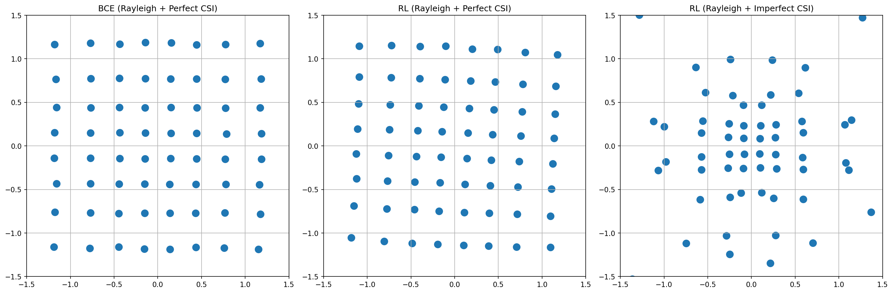

# 端到端自编码器通信系统：从 AWGN 到瑞利衰落与 CSI 不确定性

## 一、项目概述

本项目基于 NVIDIA Sionna 框架（基于 PyTorch 的 6G 物理层仿真器），实现并扩展了端到端自编码器通信系统。项目从 Sionna 官方 `Autoencoder.ipynb` 教程出发，依次完成以下工作。第一，在 AWGN 信道下复现官方示例，验证 BCE（二元交叉熵）训练与 RL（强化学习）策略梯度训练两种方法，确认自编码器相比传统 LDPC+64QAM+APP 基线获得约 1 dB 的 $E_b/N_0$ 增益。第二，将信道从 AWGN 扩展到瑞利块衰落信道，引入完美 CSI 与不完美 CSI 两种场景。第三，设计模型失配实验：BCE 自编码器在完美 CSI 下训练、不完美 CSI 下测试，RL 自编码器直接在不完美 CSI 下训练并测试，系统比较两种训练方法在信道估计误差下的鲁棒性差异。第四，通过学习星座图可视化给出可解释性分析，解释 RL 为何在不完美 CSI 下优于 BCE。

项目在 NVIDIA RTX 4060 Laptop GPU 上完成全部训练与评估，总耗时约 8 分钟。所有代码兼容 Windows 环境（无 Triton 依赖），可直接运行复现。

---

## 二、文献综述与现有工作空白

### 2.1 端到端自编码器通信的起源

端到端自编码器通信的思想由 O'Shea 和 Hoydis 在 2017 年的系统性地提出 [1]。他们将整个通信链路建模为一个自编码器：发射端是编码器，将源比特映射为发送符号；信道是带噪声的瓶颈层；接收端是解码器，将含噪符号还原为比特估计。通过反向传播端到端联合优化发射端和接收端，可以突破传统分模块设计（信源编码、信道编码、调制、解调、解码各自独立优化）的局部最优限制。该工作在 AWGN 信道下展示了自编码器逼近甚至超越传统方案的性能潜力。

随后 Cammerer 等人 [2] 在 2020 年实现了可训练通信系统的硬件原型，验证了端到端学习方法在实际软件无线电平台上的可行性，证明自编码器通信不只是仿真层面的理论探索。

### 2.2 模型无关训练方法

传统 BCE 训练要求信道模型可微，梯度从损失函数经过解码器、信道一路反传到编码器。这限制了该方法只能用于已知解析表达式的可微信道。Ait Aoudia 和 Hoydis 在 2019 年提出了模型无关的交替训练方法 [3]：接收端用 BCE 监督学习训练，发射端用策略梯度强化学习训练，在信道后截断梯度。该方法不需要信道可微，甚至不需要显式信道模型，可以直接在真实硬件上训练。Sionna 官方 `Autoencoder.ipynb` 教程即基于此方法实现了 AWGN 下的 RL 训练示例。

Goutay 等人 [4] 进一步将交替训练扩展到含噪反馈链路的场景，并在 AWGN 和瑞利块衰落（RBF）信道上验证了方法的有效性。他们的工作表明，即使在反馈不理想的情况下，RL 交替训练仍能达到与完美反馈相当的性能。

### 2.3 CSI 不确定性与鲁棒性

实际无线通信中，接收端通过导频估计信道状态信息（CSI），估计不可避免地存在误差。如何在不完美 CSI 下保持通信性能是物理层设计的核心问题之一。近期有研究将 GAN 与注意力机制结合 [5]，在瑞利衰落和不完美 CSIR 条件下提升自编码器的鲁棒性，但采用的是端到端可微训练加对抗训练的方案，而非 RL 策略梯度。Owfi 等人 [6] 提出了基于元学习的在线自适应信道自编码器框架，解决动态信道下少样本快速适应的问题，但同样基于可微训练范式。

### 2.4 现有工作的三个空白

综合以上文献调研，现有公开工作存在三个层面的空白。

第一层，信道扩展层面。将 Sionna 官方 AWGN 示例替换为瑞利衰落的项目在 GitHub 上数量不少，但绝大多数止步于"换信道后重新跑 BCE 训练并出 BLER 曲线"，未涉及训练方法在衰落信道下的系统对比。

第二层，训练方法层面。RL 策略梯度训练在 Sionna 官方示例中仅有 AWGN 版本，社区中真正复现并扩展到衰落信道的实现很少。现有物理层 AI 教程项目以 BCE 反向传播为主流。

第三层，模型失配与 CSI 不确定性层面。学术界有鲁棒自编码器、信道感知训练等方向，但它们通常采用端到端可微训练或对抗训练来对抗信道不确定性，而非用 RL 策略梯度。将"完美 CSI 训练、不完美 CSI 测试"定义为模型失配场景，并系统比较 BCE 与 RL 在该场景下的性能差异，再用学习星座图做可解释性分析，这一完整闭环在现有公开教程和项目中未见报道。

本项目的切入点正是第三层空白：不声称发现了新算法，而是用现有工具搭建一个能清晰展示"模型失配条件下 RL 优于 BCE"的实验框架，并用双证据（BLER 曲线加星座图）给出可解释的结论。

---

## 三、理论基础

### 3.1 端到端自编码器通信原理

传统通信系统采用分模块设计：信源编码、信道编码、调制、信道传输、解调、信道解码。每个模块根据信息论和通信理论独立设计，模块之间通过标准接口连接。这种设计的好处是每个模块都有理论保证，但缺点是模块之间没有联合优化，整体性能可能不是全局最优。

自编码器通信将整个链路建模为一个神经网络。发射端编码器将源比特 $\mathbf{b} \in \{0,1\}^k$ 映射为发送符号 $\mathbf{x} \in \mathbb{C}^n$，信道对符号施加噪声和衰落产生接收信号 $\mathbf{y} \in \mathbb{C}^n$，接收端解码器将 $\mathbf{y}$ 还原为比特估计 $\hat{\mathbf{b}}$。整个系统从输入到输出构成一个可微（或半可微）的计算图，通过梯度下降联合优化发射端和接收端的所有参数 $\theta_{\text{TX}}$ 和 $\theta_{\text{RX}}$，目标是最小化重构误差：

$$\min_{\theta_{\text{TX}}, \theta_{\text{RX}}} \; \mathbb{E}_{\mathbf{b}, \mathbf{y}} \left[ \mathcal{L}(\mathbf{b}, \hat{\mathbf{b}}) \right]$$

其中 $\mathcal{L}$ 是损失函数（如二元交叉熵），期望在源比特分布和信道随机性上取平均。联合优化的关键优势在于发射端和接收端可以协同调整：发射端可以学习最优的星座几何（星座成形），接收端可以学习与之匹配的非线性检测映射，两者共同逼近全局最优。

### 3.2 AWGN 信道模型

AWGN（加性高斯白噪声）信道是最基本的信道模型：

$$\mathbf{y} = \mathbf{x} + \mathbf{n}$$

其中 $\mathbf{n} \sim \mathcal{CN}(\mathbf{0}, N_0 \mathbf{I})$ 是复高斯噪声，$N_0$ 是噪声功率谱密度。$N_0$ 通过 $E_b/N_0$ 计算：

$$N_0 = \frac{1}{(E_b/N_0) \cdot R \cdot \log_2 M}$$

其中 $R$ 是信道编码码率，$M$ 是调制阶数。在本项目中 $R = 0.5$，$M = 64$（64-QAM），$\log_2 M = 6$。AWGN 信道是可微的，梯度可以从损失函数经过加噪操作一路反传到发射端，这是 BCE 训练的前提。

### 3.3 瑞利块衰落信道模型

瑞利衰落信道模拟多径环境下无直射路径的快速衰落：

$$\mathbf{y} = h \cdot \mathbf{x} + \mathbf{n}$$

其中 $h \sim \mathcal{CN}(0, 1)$ 是复高斯衰落系数，满足 $|h|$ 服从瑞利分布、$\arg(h)$ 服从均匀分布。本项目采用块衰落（block fading）模型：每个码字（1500 个比特对应 250 个符号）共享同一个衰落系数 $h$，不同码字之间 $h$ 独立生成。块衰落模型的物理含义是：在一个码字传输时间内信道保持不变，但在码字之间信道随机变化，这对应慢衰落或静止用户的场景。

块衰落相对于符号级独立衰落的区别在于：符号级衰落中每个符号经历独立的 $h$，深衰落事件被分散到各个符号上，LDPC 码的纠错能力可以有效对抗；而块衰落中整个码字要么全部处于深衰落（$|h|$ 很小），要么全部处于良好状态，LDPC 码无法通过码字内部的冗余来对抗，因此块衰落对系统性能的影响更严重。

$h$ 的生成方式为：

$$h = \frac{h_R + j \cdot h_I}{\sqrt{2}}, \quad h_R, h_I \sim \mathcal{N}(0, 1)$$

这样 $E[|h|^2] = E[h_R^2] + E[h_I^2] = 1$，保证了衰落不改变信号的平均功率。

### 3.4 信道状态信息与估计误差

接收端需要知道信道系数 $h$ 才能进行均衡和解调。本项目考虑两种 CSI 场景。

完美 CSI：接收端已知真实的 $h$，即 $\hat{h} = h$。这是理想化假设，实际中不可能完全实现，但作为性能上界参考。

不完美 CSI：接收端通过导频估计获得的信道估计值为：

$$\hat{h} = h + e$$

其中 $e \sim \mathcal{CN}(0, \sigma_e^2)$ 是估计误差，$e$ 与 $h$ 独立。本项目取 $\sigma_e^2 = 0.1$，对应的归一化均方误差（NMSE）为：

$$\text{NMSE} = \frac{E[|\hat{h} - h|^2]}{E[|h|^2]} = \frac{\sigma_e^2}{1} = 0.1 = -10 \text{ dB}$$

NMSE 为 $-10$ dB 是一个典型的中等质量信道估计水平，对应导频信噪比约 10 dB 的场景。

接收端采用迫零均衡消除衰落影响：

$$y_{\text{eq}} = \frac{y}{\hat{h}} = \frac{h \cdot x + n}{\hat{h}}$$

在完美 CSI 下，$\hat{h} = h$，均衡后信号为 $y_{\text{eq}} = x + n/h$，等效噪声为 $n/h$，等效噪声方差为：

$$N_{0,\text{eff}} = \frac{N_0}{|h|^2}$$

在完美 CSI 下，均衡后的信号模型仍然是 $y_{\text{eq}} = x + \tilde{n}$，其中 $\tilde{n}$ 是方差为 $N_0/|h|^2$ 的高斯噪声。系统性能由瞬时信噪比 $|h|^2 \cdot E_b/N_0$ 决定，深衰落（$|h|^2$ 很小）会导致瞬时信噪比极低，产生不可纠正的突发错误。

在不完美 CSI 下，均衡后的信号为：

$$y_{\text{eq}} = \frac{h \cdot x + n}{h + e} = \frac{h}{h+e} \cdot x + \frac{n}{h+e}$$

此时存在两个问题。第一，信号分量被乘以 $h/(h+e) \neq 1$，引入了与信号相关的乘性失真，这不再是简单的加性噪声模型。第二，等效噪声方差为 $N_0/|h+e|^2$，由于 $\hat{h} = h + e$ 的幅度与真实 $h$ 不同，噪声方差估计也有偏差。更关键的是，神经解映射器接收的 $N_{0,\text{eff}}$ 是基于 $\hat{h}$ 计算的，但实际失真并非纯加性高斯，这就造成了模型失配：解映射器在训练时学到的输入分布与测试时遇到的不一致。

### 3.5 BCE 训练原理

BCE 训练是标准的监督学习方法。发射端将编码后的比特 $\mathbf{c} \in \{0,1\}^n$ 通过可学习星座映射为符号 $\mathbf{x}$，经过信道传输后接收端神经解映射器输出每个比特的对数似然比（LLR）。对 LLR 施加 sigmoid 激活得到比特为 1 的预测概率 $p_i$，损失函数为二元交叉熵：

$$\mathcal{L}_{\text{BCE}} = -\frac{1}{n} \sum_{i=1}^{n} \left[ c_i \log p_i + (1 - c_i) \log(1 - p_i) \right]$$

其中 $n = 1500$ 是每个码字的比特数，$c_i$ 是第 $i$ 个编码比特的真实值，$p_i = \sigma(\text{LLR}_i)$ 是接收端预测的第 $i$ 个比特为 1 的概率，$\sigma(\cdot)$ 是 sigmoid 函数。在代码实现中使用 `F.binary_cross_entropy_with_logits`，它内部自动完成 sigmoid 和 BCE 计算，数值稳定性更好。

BCE 训练要求从损失函数到发射端参数的完整梯度路径。在 AWGN 信道下，加噪操作 $y = x + n$ 对 $x$ 的梯度为 1，梯度可以正常反传。在瑞利完美 CSI 下，均衡操作 $y_{\text{eq}} = y / h$ 对 $x$ 的梯度为 $h / h = 1$（$h$ 不依赖 $\theta_{\text{TX}}$），梯度仍可反传。因此在完美 CSI 下 BCE 训练可以正常工作。

BCE 训练的优点是梯度估计方差低、收敛速度快、实现简单。缺点是 BCE 只是代理损失，最小化 BCE 不等于最小化 BLER（因为 BLER 涉及不可微的硬判决和 LDPC 解码）。此外，BCE 要求信道可微，一旦信道包含不可微操作（量化、限幅、硬件非线性）或训练与测试的信道模型不一致（模型失配），BCE 的性能就会下降。

### 3.6 RL 策略梯度训练原理

RL 训练的核心思想是在信道后截断梯度，用策略梯度优化发射端，使其不依赖信道的可微性。

发射端被建模为随机策略网络。给定编码比特状态 $\mathbf{c}$，策略网络输出确定性星座点 $\mathbf{x}$，然后在 $\mathbf{x}$ 上添加高斯扰动 $\boldsymbol{\varepsilon}$ 进行探索：

$$\mathbf{x}_p = \mathbf{x} + \boldsymbol{\varepsilon}, \quad \boldsymbol{\varepsilon} \sim \mathcal{CN}(\mathbf{0}, \sigma_p^2 \mathbf{I})$$

其中 $\sigma_p^2 = 0.01$ 是探索方差。扰动后的符号 $\mathbf{x}_p$ 通过信道前向传播，在信道后调用 `detach()` 截断梯度，接收端解映射器输出 LLR 并计算 BCE。此时 BCE 被视为奖励信号（BCE 越低，说明接收端解码越准确，发射端的发送策略越好）。

策略梯度的核心公式为：

$$\nabla_\theta J(\theta) = \mathbb{E} \left[ \nabla_\theta \log \pi(\mathbf{a}|\mathbf{s}) \cdot R \right]$$

其中 $\pi(\mathbf{a}|\mathbf{s})$ 是策略（高斯分布，中心为 $\mathbf{x}$，方差为 $\sigma_p^2$），$\mathbf{a} = \mathbf{x}_p$ 是动作，$R$ 是奖励。对于高斯策略，对数似然的梯度为：

$$\nabla_\theta \log \pi(\mathbf{x}_p | \mathbf{c}) = \frac{\boldsymbol{\varepsilon}}{\sigma_p^2} \cdot \nabla_\theta \mathbf{x}$$

因此策略梯度变为：

$$\nabla_\theta J \propto \mathbb{E} \left[ \frac{\boldsymbol{\varepsilon}}{\sigma_p^2} \cdot R \cdot \nabla_\theta \mathbf{x} \right]$$

在代码实现中，发射端损失函数构造为：

$$\mathcal{L}_{\text{TX}} = -\text{BCE}_{\text{detach}} \cdot \frac{|\mathbf{x}_p - \mathbf{x}|^2}{\sigma_p^2}$$

其中 $\text{BCE}_{\text{detach}}$ 表示 BCE 被分离（不通过接收端反传梯度），$|\mathbf{x}_p - \mathbf{x}|^2 = |\boldsymbol{\varepsilon}|^2$。对 $\theta_{\text{TX}}$ 求梯度时，由于 $\mathbf{x}_p$ 被 detach，梯度只通过 $\mathbf{x}$ 流动，得到：

$$\nabla_\theta \mathcal{L}_{\text{TX}} \propto \text{BCE} \cdot \frac{\boldsymbol{\varepsilon}}{\sigma_p^2} \cdot \nabla_\theta \mathbf{x}$$

这与策略梯度公式一致（符号方向上，由于是最小化损失，实际是梯度下降）。奖励 $R = \text{BCE}$ 的含义是：如果某个扰动方向导致 BCE 降低（解码更好），则增大发射端在该方向上移动的概率；反之则减小。

RL 训练采用交替策略：每轮先训练接收端 10 步（标准 BCE 监督学习，信道后截断梯度不影响接收端训练），再训练发射端 1 步（策略梯度）。交替训练 3500 轮后，再单独微调接收端 1500 步，确保接收端充分适应最终的发射星座。

RL 训练的优点是不依赖信道可微，可以直接在不可微信道（硬件非线性、量化）或模型失配场景下训练。缺点是梯度估计方差大、收敛速度慢、需要更多训练迭代。

### 3.7 星座成形原理

星座成形（constellation shaping）是自编码器通信获得性能增益的重要来源之一。对于 AWGN 信道，信息论表明最优输入分布是高斯分布而非均匀分布。标准 $M$-QAM 的星座点均匀分布在正方形网格上，每个点等概率出现，对应的输入分布是均匀的，不是最优的。

星座成形通过调整星座点的位置，使整体输入分布更接近高斯分布。具体表现为：靠近原点的点保持密集（高概率区域），远离原点的点向外扩展（低概率区域但更大的欧氏距离）。由于外侧点向外推可以增大与内侧邻居的欧氏距离，提高判别能力，同时增加的平均能量有限，因此成形可以在不显著增加发射功率的前提下降低错误概率。

在 AWGN 信道中，星座成形的增益约 0.5 至 1 dB。但在瑞利衰落信道中，系统性能由深衰落事件主导，星座几何优化的边际收益被信道随机性掩盖，因此成形增益不明显。在不完美 CSI 下，情况更复杂：信道估计误差引入了与信号相关的乘性失真，传统依赖精确相位和幅度判决的 QAM 星座容易出错，而更分散的星座对位置误差不敏感，可能获得统计鲁棒性。

### 3.8 $E_b/N_0$ 与噪声方差的关系

$E_b/N_0$（每比特能量与噪声功率谱密度之比）是数字通信中最基本的信噪比度量。Sionna 的 `ebnodb2no` 函数将 $E_b/N_0$（dB）转换为噪声方差 $N_0$：

$$N_0 = \frac{1}{10^{E_b/N_0(\text{dB})/10} \cdot R \cdot \log_2 M}$$

其中 $R = k/n = 0.5$ 是码率，$M = 64$ 是调制阶数，$\log_2 M = 6$。例如，当 $E_b/N_0 = 6$ dB 时：

$$N_0 = \frac{1}{10^{0.6} \times 0.5 \times 6} = \frac{1}{3.981 \times 3} \approx 0.0837$$

在瑞利完美 CSI 下，有效噪声方差为 $N_{0,\text{eff}} = N_0 / |h|^2$，由于 $|h|^2$ 服从指数分布（均值为 1），有效噪声方差的波动范围很大，这正是深衰落导致性能下降的数学根源。

---

## 四、系统架构与实现

### 4.1 整体架构

本项目实现三种系统：传统基线系统（Baseline）、BCE 自编码器系统、RL 自编码器系统。每种系统支持两种信道类型（AWGN、瑞利衰落）和两种 CSI 模式（完美、不完美），通过参数化配置灵活组合。所有系统共享相同的系统参数：信息位长度 $k = 750$ bit，码字长度 $n = 1500$ bit，调制阶数 64-QAM（每符号 6 bit），LDPC 5G 码，码率 $R = 0.5$。

### 4.2 传统基线系统（Baseline）

基线系统采用标准通信架构，各模块独立设计，不包含任何可学习参数（除 LDPC 编解码器的内置结构外）。

信号流程如下。源比特 $\mathbf{b} \in \{0,1\}^{750}$ 经过 LDPC 5G 编码器添加冗余，输出编码比特 $\mathbf{c} \in \{0,1\}^{1500}$。编码比特进入 64-QAM 调制器（`Mapper`），每 6 个比特映射为一个复数符号，星座点排列在标准 $8 \times 8$ 均匀网格上，共 250 个符号。符号通过信道（AWGN 或瑞利衰落），接收端先用 APP 解映射器（`Demapper("app")`）计算每个比特的对数似然比，再将 LLR 送入 LDPC 5G 解码器进行硬判决纠错解码，输出比特估计 $\hat{\mathbf{b}}$。

APP 解映射器基于贝叶斯准则计算最优 LLR，对于给定接收信号 $y$ 和噪声方差 $N_0$，第 $i$ 个比特的 LLR 为：

$$\text{LLR}_i = \log \frac{\sum_{x \in \mathcal{X}_i^{(0)}} p(y|x)}{\sum_{x \in \mathcal{X}_i^{(1)}} p(y|x)}$$

其中 $\mathcal{X}_i^{(0)}$ 和 $\mathcal{X}_i^{(1)}$ 分别是第 $i$ 个比特为 0 和 1 的星座点子集，$p(y|x) \propto \exp(-|y-x|^2 / N_0)$。APP 解映射器在 AWGN 下是最优的，但在不完美 CSI 下由于等效噪声不再是纯高斯的，其最优性不再成立。

在瑞利衰落信道下，基线系统使用 `apply_rayleigh_fading` 函数生成衰落、施加均衡，然后将均衡后的信号 $y_{\text{eq}}$ 和有效噪声方差 $N_{0,\text{eff}}$ 传入 APP 解映射器。

### 4.3 BCE 自编码器系统

BCE 自编码器系统将发射端的星座和接收端的解映射器替换为可学习神经网络，其余模块（LDPC 编解码器）保持不变。

发射端的关键组件是可学习星座 `Constellation("custom")`。标准 64-QAM 的星座点是固定的 $8 \times 8$ 网格，而可学习星座的 64 个点的实部和虚部分别存储为可训练参数 `points_r` 和 `points_i`，初始化为标准 64-QAM 网格。`Constellation` 设置 `normalize=True`（归一化平均功率为 1）和 `center=True`（中心化使均值为 0）。`Mapper` 根据编码比特选择对应的星座点作为发送符号。

接收端使用神经解映射器（`NeuralDemapper`）替代 APP 解映射器。神经解映射器的输入有三个通道：接收信号的实部 $\text{Re}(y_{\text{eq}})$、虚部 $\text{Im}(y_{\text{eq}})$、以及噪声方差的对数 $\log_{10}(N_{0,\text{eff}})$。噪声方差作为输入而非条件参数，使网络能自适应不同信噪比。网络结构为三层全连接网络：第一层 $3 \to 128$，第二层 $128 \to 128$，第三层 $128 \to 6$（输出 6 个比特的 LLR），前两层使用 ReLU 激活函数。将噪声方差的对数作为输入维度而非简单的标量条件，允许网络在不同信噪比下学习不同的检测策略。

在训练模式下（`training=True`），系统不使用 LDPC 编解码器，直接从编码比特 $\mathbf{c}$ 生成符号、通过信道、解映射、计算 BCE 损失。梯度从 BCE 损失经过神经解映射器、信道、映射器反传到星座点参数。在评估模式下（`training=False`），系统使用完整的 LDPC 编解码链路，输出硬判决比特用于 BLER 统计。

### 4.4 RL 自编码器系统

RL 自编码器系统的网络架构与 BCE 系统完全相同，区别在于训练方法。RL 系统的 `forward` 方法多了一个 `perturbation_variance` 参数，控制探索强度。

在训练模式下，发射端生成符号 $\mathbf{x}$ 后添加高斯扰动 $\boldsymbol{\varepsilon}$ 得到 $\mathbf{x}_p$。扰动后的符号通过信道前向传播，但在信道输出后调用 `y.detach()` 截断梯度，使梯度不会通过信道反传到发射端。接收端解映射器对 $\mathbf{y}$ 计算 LLR，然后分两路计算损失。

接收端损失：对 LLR 和编码比特计算标准 BCE，梯度正常反传更新接收端参数。

发射端损失：将 BCE 分离（`detach()`）作为奖励信号，计算 $\mathcal{L}_{\text{TX}} = -\text{BCE}_{\text{detach}} \cdot |\boldsymbol{\varepsilon}|^2 / \sigma_p^2$，梯度通过 $\mathbf{x}$ 反传更新发射端星座点参数。

在评估模式下，RL 系统不添加扰动，直接使用学到的星座点进行传输，链路与 BCE 系统一致。

### 4.5 瑞利衰落信道实现

`apply_rayleigh_fading` 函数是本项目的核心扩展模块，实现了瑞利块衰落信道和两种 CSI 模式。

函数输入为发送符号 $\mathbf{x}$（形状 $[\text{batch}, 250]$）、噪声方差 $N_0$、CSI 模式和 CSI 误差方差。函数首先生成块衰落系数 $h$（形状 $[\text{batch}, 1]$，每个码字一个系数），然后施加衰落 $h \cdot \mathbf{x}$，再通过 Sionna 的 `AWGN` 层添加噪声。接着根据 CSI 模式生成信道估计 $\hat{h}$：完美模式下 $\hat{h} = h$，不完美模式下 $\hat{h} = h + e$，$e \sim \mathcal{CN}(0, \sigma_e^2)$。最后执行迫零均衡 $y_{\text{eq}} = y / \hat{h}$，计算有效噪声方差 $N_{0,\text{eff}} = N_0 / |\hat{h}|^2$，返回均衡后信号和有效噪声方差。

### 4.6 代码结构总结

完整代码 `rayleigh_autoencoder.py` 约 770 行，结构如下。仿真参数定义（第 37-74 行）：系统参数、SNR 范围、训练配置、CSI 配置、权重路径。`NeuralDemapper` 类（第 80-94 行）：三层全连接神经解映射器。`apply_rayleigh_fading` 函数（第 100-145 行）：瑞利衰落信道与 CSI 实现。`E2ESystemConventionalTraining` 类（第 151-213 行）：BCE 自编码器系统。`E2ESystemRLTraining` 类（第 219-298 行）：RL 自编码器系统。`Baseline` 类（第 304-340 行）：传统基线系统。训练函数（第 346-395 行）：`conventional_training` 和 `rl_based_training`。冒烟测试（第 411-480 行）：验证所有前向和反向传播。训练流水线（第 486-539 行）：训练 5 个模型。评估函数（第 545-644 行）：蒙特卡洛评估 7 种配置。绘图函数（第 650-751 行）：BLER 曲线和星座图。

---

## 五、训练流程

### 5.1 训练参数配置

| 参数 | 值 | 说明 |
|------|-----|------|
| 信息位长度 $k$ | 750 bit | LDPC 编码前 |
| 码字长度 $n$ | 1500 bit | LDPC 编码后 |
| 调制阶数 | 64-QAM | 每符号 6 bit |
| 码率 $R$ | 0.5 | $k/n$ |
| 每码字符号数 | 250 | $n / \log_2 M$ |
| BCE 训练迭代数 | 5000 | Adam 优化器 |
| RL 交替训练轮数 | 3500 | 每轮 10 步 RX + 1 步 TX |
| RX 微调迭代数 | 1500 | 交替训练后单独微调 |
| 训练 batch size | 128 | 每次迭代生成的码字数 |
| RL 探索方差 $\sigma_p^2$ | 0.01 | 高斯扰动方差 |
| CSI 误差方差 $\sigma_e^2$ | 0.1 | NMSE = $-10$ dB |
| AWGN 训练 SNR 范围 | 4.0-8.0 dB | 均匀随机采样 |
| 瑞利训练 SNR 范围 | 10.0-25.0 dB | 均匀随机采样 |
| 优化器 | Adam | 默认学习率 |

训练时 $E_b/N_0$ 不是固定值，而是在指定范围内均匀随机采样，每次迭代生成不同的 SNR。这种 SNR 扫描训练策略使模型在较宽的 SNR 范围内都能良好工作，而非只在某个特定 SNR 点最优。

### 5.2 BCE 训练流程

BCE 训练流程简洁直接。每步迭代：随机采样 128 个 $E_b/N_0$ 值（在训练范围内均匀分布），生成 128 个码字（每个 1500 bit），通过星座映射、信道传输、神经解映射，计算 BCE 损失，反向传播更新所有参数（星座点实部虚部加神经解映射器权重），使用 Adam 优化器。共 5000 次迭代。

训练日志显示 BCE 损失从初始值约 0.69（随机猜测水平，$\log 2 \approx 0.693$）快速下降并收敛：

| 模型 | 初始 BCE | 500 次迭代 | 最终 BCE | 耗时 |
|------|---------|-----------|---------|------|
| AWGN BCE | 0.6898 | 0.2933 | 0.2811 | 18 s |
| 瑞利完美 CSI BCE | 0.6925 | 0.0945 | 0.0803 | 23 s |

瑞利完美 CSI 的 BCE 值远低于 AWGN，这是因为瑞利训练的 SNR 范围（10-25 dB）远高于 AWGN（4-8 dB），在大部分训练样本中信道条件较好，BCE 自然更低。

### 5.3 RL 交替训练流程

RL 训练采用交替策略，分为两个阶段。

第一阶段，交替训练 3500 轮。每轮包含：接收端训练 10 步（标准 BCE 监督学习，信道后截断梯度，更新神经解映射器权重），然后发射端训练 1 步（添加探索扰动，前向传播，在信道后 detach，计算发射端策略梯度损失，更新星座点参数）。接收端训练 10 步是为了确保接收端充分适应当前的发射星座，再让发射端根据接收端反馈进行策略调整。发射端每轮只训练 1 步，是因为策略梯度方差大，需要更多轮次积累有效梯度信号。

第二阶段，接收端微调 1500 步。交替训练结束后，发射星座已经稳定，此时单独训练接收端 1500 步，使接收端充分适应最终的发射星座，提升检测性能。

训练日志显示 RL 训练的收敛情况：

| 模型 | 初始 RX BCE | 500 轮 | 最终交替 BCE | 微调后 BCE | 耗时 |
|------|------------|--------|-------------|-----------|------|
| AWGN RL | 0.6453 | 0.2882 | 0.2795 | 0.2853 | 126 s |
| 瑞利完美 CSI RL | 0.6395 | 0.0860 | 0.1042 | 0.0926 | 157 s |
| 瑞利不完美 CSI RL | 0.6483 | 0.3554 | 0.3334 | 0.3236 | 155 s |

RL 训练耗时显著长于 BCE（约 6-8 倍），原因是每轮需要 11 步前向反向传播（10 步 RX + 1 步 TX），而 BCE 每步只需 1 次前向反向传播。不完美 CSI 下的最终 BCE（0.3236）远高于完美 CSI（0.0926），反映了信道估计误差对解码性能的显著影响。

### 5.4 五个训练模型

项目共训练 5 个模型：

1. AWGN BCE 自编码器：在 AWGN 信道下用 BCE 训练，作为 AWGN 基线复现。
2. AWGN RL 自编码器：在 AWGN 信道下用 RL 策略梯度训练，作为 AWGN 基线复现。
3. 瑞利完美 CSI BCE 自编码器：在瑞利衰落加完美 CSI 下用 BCE 训练，用于完美 CSI 评估和模型失配测试（加载完美 CSI 权重，在不完美 CSI 下测试）。
4. 瑞利完美 CSI RL 自编码器：在瑞利衰落加完美 CSI 下用 RL 训练，用于完美 CSI 评估。
5. 瑞利不完美 CSI RL 自编码器：在瑞利衰落加不完美 CSI 下用 RL 训练，用于不完美 CSI 评估。

注意：没有训练"瑞利不完美 CSI BCE"模型，因为模型失配实验的核心设计就是 BCE 在完美 CSI 下训练、不完美 CSI 下测试，这正是模型失配的定义。如果 BCE 也在不完美 CSI 下训练，就不是模型失配了。

### 5.5 Windows 兼容性处理

在 Windows 上运行 Sionna 时，PyTorch 2.0 的 `torch.compile()` 功能依赖 Triton 编译器进行即时编译，而 Triton 不支持 Windows，导致 `TritonMissing` 错误。解决方案分三步。

第一步，移除代码中所有 `torch.compile()` 包装器，直接使用原始模型。第二步，将 `sim_ber` 的 `compile_mode` 参数从 `"reduce-overhead"` 改为 `None`，禁用评估时的编译。第三步，加载权重时使用 `strict=False`，允许状态字典中的键不完全匹配（因为移除 `torch.compile` 后模型结构有细微变化）。这不影响仿真结果的正确性，只是损失一些编译加速。训练阶段不需要 `torch.compile`，因为训练循环本身就是逐步执行的。

---

## 六、评估方法

### 6.1 蒙特卡洛仿真

评估使用 Sionna 提供的 `sim_ber` 函数进行蒙特卡洛仿真。对于每个 $E_b/N_0$ 值，反复生成随机比特块，通过系统发送和接收，统计误块数。仿真持续进行，直到满足停止条件之一：收集到足够多的误块（达到目标误块数），或达到最大迭代次数。

评估参数配置：`batch_size=128`（每次迭代生成 128 个码字），`num_target_block_errors=200`（收集到 200 个误块时提前停止），`max_mc_iter=200`（最多迭代 200 次），`compile_mode=None`（禁用编译，兼容 Windows）。

`num_target_block_errors` 的作用是保证统计可靠性。在低 BLER 区域，误块极少，如果不设提前停止条件，要么仿真时间极长，要么统计样本不够导致结果不可靠。设置目标误块数后，低 BLER 区域会多跑几轮以收集足够的误块，高 BLER 区域则提前停止节省时间。

### 6.2 SNR 扫描范围

AWGN 信道评估范围：$E_b/N_0$ 从 4.0 到 7.5 dB，步长 0.5 dB，共 8 个点。这个范围覆盖了瀑布曲线的陡降区域，是性能对比最有意义的区间。4 dB 以下所有系统 BLER 接近 1 没有区分度，7.5 dB 以上 BLER 低于 $10^{-3}$ 仿真需要极长时间。

瑞利衰落信道评估范围：$E_b/N_0$ 从 10.0 到 24.5 dB，步长 0.5 dB，共 30 个点。瑞利衰落需要更高的 SNR 才能达到相同的 BLER，因为深衰落事件拉高了所需的平均 SNR。不完美 CSI 场景下 BLER 存在误差平台，需要更宽的 SNR 范围来观察平台行为。

### 6.3 评估的 7 种配置

| 配置名称 | 系统 | 信道 | CSI 模式 | 权重来源 |
|---------|------|------|---------|---------|
| AWGN Baseline | 基线 | AWGN | 无 | 无可学习参数 |
| AWGN BCE | BCE 自编码器 | AWGN | 无 | AWGN BCE 训练 |
| AWGN RL | RL 自编码器 | AWGN | 无 | AWGN RL 训练 |
| 瑞利 Baseline | 基线 | 瑞利 | 完美 CSI | 无可学习参数 |
| 瑞利 BCE 完美 CSI | BCE 自编码器 | 瑞利 | 完美 CSI | 瑞利 BCE 训练 |
| 瑞利 RL 完美 CSI | RL 自编码器 | 瑞利 | 完美 CSI | 瑞利 RL 训练 |
| 瑞利 Baseline 不完美 | 基线 | 瑞利 | 不完美 CSI | 无可学习参数 |
| 瑞利 BCE 模型失配 | BCE 自编码器 | 瑞利 | 不完美 CSI | 瑞利 BCE 训练（完美 CSI 权重） |
| 瑞利 RL 不完美 CSI | RL 自编码器 | 瑞利 | 不完美 CSI | 瑞利 RL 不完美 CSI 训练 |

瑞利 BCE 模型失配是核心实验：加载的权重是在完美 CSI 下训练的，但测试时信道使用不完美 CSI，造成训练与测试的信道模型不一致。瑞利 RL 不完美 CSI 是对照实验：权重直接在不完美 CSI 下训练并测试，不存在模型失配。

---

## 七、实验结果

### 7.1 AWGN 信道（基线复现）

完整 BLER 数据：

| $E_b/N_0$ [dB] | Baseline BLER | BCE BLER | RL BLER |
|---------------:|--------------:|---------:|--------:|
| 4.0 | 1.0000 | 0.9961 | 0.9922 |
| 4.5 | 0.9922 | 0.9453 | 0.8828 |
| 5.0 | 0.8906 | 0.5365 | 0.5313 |
| 5.5 | 0.4688 | 0.1506 | 0.1563 |
| 6.0 | 0.1089 | 0.01669 | 0.01460 |
| 6.5 | 0.00822 | 0.000781 | 0.000898 |
| 7.0 | 0.000664 | 0.000156 | 0.0000781 |
| 7.5 | 0.0000781 | 0.0000391 | 0.0000 |

分析：两种自编码器在 AWGN 下性能几乎一致，在 BLER = $10^{-3}$ 时比基线好约 1 dB。具体来看，在 5.5 dB 时基线 BLER 为 0.469，而自编码器已降至 0.15 左右；在 6.0 dB 时基线仍为 0.109，自编码器已降至 0.015。这 1 dB 增益主要来自联合优化和学习型星座成形：自编码器的星座点外侧向外扩展，逼近高斯最优输入分布，而基线的标准 64-QAM 是均匀分布。这个结果复现了 Sionna 官方示例的结论，验证了代码实现的正确性。

### 7.2 瑞利衰落 + 完美 CSI

完整 BLER 数据，选取关键 SNR 点：

| $E_b/N_0$ [dB] | Baseline BLER | BCE BLER | RL BLER |
|---------------:|--------------:|---------:|--------:|
| 10.0 | 0.2656 | 0.2917 | 0.2982 |
| 12.0 | 0.2002 | 0.1753 | 0.1944 |
| 14.0 | 0.1428 | 0.1367 | 0.1250 |
| 16.0 | 0.0608 | 0.0507 | 0.0544 |
| 18.0 | 0.0478 | 0.0542 | 0.0473 |
| 20.0 | 0.0316 | 0.0381 | 0.0330 |
| 22.0 | 0.0219 | 0.0242 | 0.0239 |
| 24.0 | 0.0141 | 0.0131 | 0.0138 |
| 24.5 | 0.0112 | 0.0126 | 0.0118 |

分析：三种系统在瑞利完美 CSI 下性能几乎重合，没有明显差异。这与 AWGN 下自编码器优于基线 1 dB 的结果形成鲜明对比。原因在于瑞利块衰落信道中，系统性能由深衰落事件主导。瞬时信噪比为 $|h|^2 \cdot E_b/N_0$，当 $|h|^2$ 很小时（深衰落），无论星座如何优化，整个码字都会因为瞬时信噪比过低而产生大量错误，LDPC 码无法纠正。星座成形在平均信噪比意义下略有优势，但这种边际收益被深衰落的统计波动所掩盖。此外，LDPC 5G 码本身已经非常接近香农容量，留给星座成形的空间有限。

### 7.3 瑞利衰落 + 不完美 CSI（模型失配）

完整 BLER 数据，选取关键 SNR 点：

| $E_b/N_0$ [dB] | Baseline 不完美 CSI | BCE 模型失配 | RL 不完美 CSI |
|---------------:|-------------------:|-------------:|--------------:|
| 10.0 | 0.6406 | 0.6484 | 0.6875 |
| 12.0 | 0.6198 | 0.6380 | 0.5651 |
| 14.0 | 0.6120 | 0.5625 | 0.5365 |
| 16.0 | 0.6250 | 0.5339 | 0.3531 |
| 18.0 | 0.6771 | 0.5391 | 0.3766 |
| 20.0 | 0.6797 | 0.5521 | 0.3926 |
| 22.0 | 0.6615 | 0.5286 | 0.3516 |
| 24.0 | 0.6927 | 0.5312 | 0.3984 |
| 24.5 | 0.7552 | 0.5651 | 0.3672 |

分析：这是项目最核心的结果，包含三个关键发现。

第一，传统基线在不完美 CSI 下出现严重的误差平台。BLER 在整个 SNR 范围内基本平坦在 0.6-0.75 之间，提高 $E_b/N_0$ 几乎无法降低 BLER。在 24.5 dB 时 BLER 甚至上升到 0.7552，这是因为高 SNR 下信号功率增大但 CSI 误差功率不变，乘性失真 $h/(h+e)$ 的影响相对更突出。基线 APP 解映射器假设等效噪声是方差为 $N_0/|\hat{h}|^2$ 的纯高斯噪声，但实际不完美 CSI 下均衡后的噪声包含乘性失真项，不再是纯高斯的，导致 APP 的 LLR 计算系统性偏差，产生不可消除的误差平台。

第二，BCE 模型失配方案也出现误差平台，但略好于基线。BCE 自编码器在完美 CSI 下训练，学到的是针对纯加性高斯噪声的最优检测策略。测试时换成不完美 CSI，均衡后的噪声分布发生了变化（多了乘性失真），但神经解映射器仍然按照训练时学到的分布进行检测，造成模型失配。BLER 平坦在 0.49-0.67 之间，虽然比基线略好（神经网络的非线性映射对分布偏移有一定的容忍度），但仍然无法通过提高 SNR 消除误差平台。

第三，RL 不完美 CSI 方案显著优于 BCE 模型失配方案。RL 自编码器直接在不完美 CSI 环境下训练，训练时就暴露在信道估计误差中，学到的发射星座和接收检测策略都针对不完美 CSI 优化。BLER 从 10 dB 的 0.6875 持续下降到 24.5 dB 的 0.3672，没有出现明显的误差平台。在 16 dB 时 RL 的 BLER 已降至 0.3531，而 BCE 模型失配仍在 0.5339；在 24.5 dB 时 RL 为 0.3672，BCE 为 0.5651，RL 的 BLER 降低了约 35%。如果以同一 BLER 水平比较，RL 相对 BCE 有约 2-4 dB 的 $E_b/N_0$ 优势。

### 7.4 不完美 CSI 下 RL vs BCE 的定量对比

| 指标 | BCE 模型失配 | RL 不完美 CSI | RL 优势 |
|------|-------------|--------------|---------|
| 16 dB BLER | 0.5339 | 0.3531 | 33.8% 降低 |
| 20 dB BLER | 0.5521 | 0.3926 | 28.9% 降低 |
| 24.5 dB BLER | 0.5651 | 0.3672 | 35.0% 降低 |
| BLER = 0.4 所需 SNR | >24.5 dB | 约 16 dB | >8.5 dB |
| BLER = 0.5 所需 SNR | 约 20 dB | 约 13 dB | 约 7 dB |
| 误差平台 | 有（0.49-0.67） | 无（持续下降） | 根本性差异 |

RL 方案的根本优势在于训练环境与测试环境一致。RL 在不完美 CSI 下训练时，发射端通过策略梯度探索学到了对信道估计误差鲁棒的星座分布（更分散、更圆对称），接收端学到了针对含乘性失真的信号的检测策略，两者协同适应了不完美 CSI 的统计特性。BCE 模型失配方案则因为训练与测试环境不一致，无法适应这种统计偏移。

---

## 八、星座图分析

### 8.1 BCE 完美 CSI 星座

左图展示 BCE 在瑞利完美 CSI 下训练学到的星座。星座整体保持 64-QAM 的网格结构，但外侧点（角落和边缘）略有向外推的趋势。这是典型的星座成形特征：外侧点向外推可以增大与内侧邻居的欧氏距离，提高抗噪能力，同时增加的平均能量有限。由于完美 CSI 下均衡后的信号模型仍然是加性高斯噪声（$y_{\text{eq}} = x + n/h$），BCE 学到的星座成形方向与 AWGN 下一致，只是成形幅度较小，因为瑞利衰落的随机性限制了成形的收益空间。

### 8.2 RL 完美 CSI 星座

中图展示 RL 在瑞利完美 CSI 下训练学到的星座。与 BCE 星座相比，RL 星座的外侧点外推更明显，整体形状更圆润。这是因为 RL 策略梯度的探索机制允许发射端尝试更多样的星座配置，探索到了更激进的成形方案。但两种方法在完美 CSI 下的 BLER 性能几乎相同（见 7.2 节），说明在完美 CSI 的瑞利衰落中，星座成形的细节差异对最终性能影响很小，深衰落才是性能瓶颈。

### 8.3 RL 不完美 CSI 星座

右图展示 RL 在不完美 CSI 下训练学到的星座，与前两者有显著差异。星座点明显分散，不再保持规则的网格结构，整体分布更接近圆对称的高斯状。这种分散的星座几何是不完美 CSI 环境下的最优策略，原因如下。

在不完美 CSI 下，均衡操作 $y_{\text{eq}} = y / \hat{h} = (h \cdot x + n) / (h + e)$ 引入了乘性失真 $h/(h+e)$，信号的等效相位和幅度都受到随机扰动。传统 QAM 依赖精确的相位和幅度判决，星座点排列在规则网格上，一旦相位旋转或幅度缩放，点之间的判决边界就会偏移，容易误判。RL 学到的分散星座对这种位置扰动不敏感：点之间的间距更均匀（不局限于网格结构），某些点偏离了精确的相位对齐位置，使得在随机相位旋转下仍能保持较好的可分性。从信息论角度看，这种更接近高斯分布的星座在统计不确定性下能最大化平均互信息，虽然牺牲了部分确定性信道下的最小欧氏距离，但换取了对信道估计误差的统计鲁棒性。

### 8.4 三种星座的对比总结

| 星座 | 结构 | 外侧点行为 | 分布特征 | 设计目标 |
|------|------|-----------|---------|---------|
| BCE 完美 CSI | 保持网格 | 略外推 | 接近均匀 | 最大化最小欧氏距离 |
| RL 完美 CSI | 网格变形 | 明显外推 | 略偏高斯 | 最大化最小距离（更激进） |
| RL 不完美 CSI | 分散无规则 | 大幅扩散 | 接近高斯/圆对称 | 最大化统计鲁棒性 |

星座图的演变清晰展示了训练方法对学习目标的影响：完美 CSI 下两种方法都追求欧氏距离最大化（只是程度不同），不完美 CSI 下 RL 转向追求统计鲁棒性，星座几何随之发生质变。

---

## 九、对比分析与结论

### 9.1 三场景对比总结

| 场景 | 自编码器 vs 基线 | BCE vs RL | 核心原因 |
|------|-----------------|-----------|---------|
| AWGN | 自编码器好约 1 dB | 两者几乎相同 | 星座成形有效，两种训练方法都能找到最优解 |
| 瑞利完美 CSI | 无明显差异 | 无明显差异 | 深衰落主导性能，星座成形收益被掩盖 |
| 瑞利不完美 CSI | RL 显著优于 BCE 失配 | RL 降低 BLER 约 35% | RL 训练环境与测试一致，BCE 存在模型失配 |

### 9.2 四个技术洞察

第一，AWGN 中的星座成形有效。在确定性加性噪声下，自编码器学习将外层星座点外推，逼近 AWGN 最优高斯输入分布，获得信噪比增益。两种训练方法（BCE 和 RL）在 AWGN 下性能一致，说明在简单可微信道中，BCE 的高效性足以找到与 RL 相同的最优解。

第二，完美 CSI 瑞利衰落中收益有限。当信道随机衰落时，瞬时 SNR 在 $|h|^2$ 上变化剧烈。即使星座成形在平均意义上略优，深衰落事件仍会导致不可纠正的突发错误，星座优化被信道统计特性主导。LDPC 5G 码本身已接近香农容量，进一步优化的空间有限。

第三，不完美 CSI 是 RL 的真正用武之地。BCE 训练要求信道模型可微且精确。一旦测试阶段的信道估计与训练阶段不一致，模型失配导致性能平台。RL 不依赖通过信道的梯度，通过接收端反馈的 BCE 作为奖励，利用扰动探索直接优化发射策略，能够适应训练与测试共享统计特性但具体实现有偏差的场景。

第四，星座图验证了策略差异。不完美 CSI 下的 RL 星座更分散，说明其学习目标是"在统计不确定性下最大化平均互信息"，而非"在确定性 AWGN 下最大化最小距离"。星座几何从规则网格到分散高斯的演变，是训练环境不确定性程度在学习结果上的直接投射。

### 9.3 项目的核心结论

本项目通过系统实验验证了一个重要结论：在信道模型存在不确定性的条件下，模型无关的 RL 策略梯度训练比传统的 BCE 反向传播训练更具鲁棒性。这一结论对 6G 物理层设计有实际意义：未来通信系统需要面对越来越复杂的信道环境（非线性功放、硬件损伤、时变干扰），传统基于精确信道模型的设计方法面临模型失配风险，而 RL 训练提供了一条不依赖精确模型的替代路径。

---
